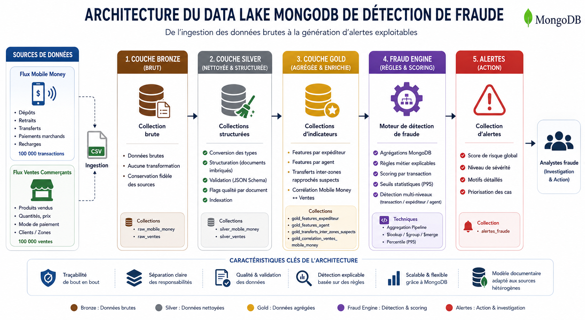

# Data Lake MongoDB de Détection de fraude à partir de flux transactionnels multi-sources


Projet réalisé dans le cadre du Master 1 DATA-IA, module **NoSQL**, à l'Université Polytechnique de Bingerville (UPB).

**Auteur :** YAO MIÉZAN SAM WILLIAM
**Enseignant :** M. SORO SEYDOU
**Année académique :** 2025-2026

---

## Architecture



Le pipeline suit un modèle en couches (*medallion architecture*) qui sépare clairement l'ingestion brute, le nettoyage, l'agrégation et la génération d'alertes, garantissant une traçabilité complète de bout en bout.

| Couche | Collections | Rôle |
|---|---|---|
| **Bronze** | `raw_mobile_money`, `raw_ventes` | Copie brute des CSV, aucune transformation |
| **Silver** | `silver_mobile_money`, `silver_ventes` | Typage, structuration en documents imbriqués, flags qualité, validation de schéma |
| **Gold** | `gold_features_expediteur`, `gold_features_agent`, `gold_transferts_inter_zones_suspects`, `gold_correlation_ventes_mobile_money` | Indicateurs agrégés par entité |
| **Alertes** | `alertes_fraude` | Transactions identifiées avec motif, score et niveau de sévérité |

---

## Contexte

Ce projet met en place un Data Lake sur MongoDB pour détecter des transactions suspectes en croisant deux flux transactionnels indépendants circulant en Côte d'Ivoire :

- **Flux Mobile Money** : 100 000 transactions réparties sur 4 opérateurs (MTN CI, Orange Money, Moov Africa, Wave)
- **Flux Ventes Commerce** : 100 000 ventes de commerçants abidjanais, dont 33 % réglées en Mobile Money

Les deux flux se recoupent sur une période commune (janvier à juin 2024) et des zones géographiques communes (Adjamé, Cocody, Marcory, Plateau, Yopougon), ce qui permet une véritable corrélation entre sources plutôt qu'une simple analyse isolée.

Le rapport complet, avec méthodologie détaillée, résultats, limites et bibliographie, est disponible dans [`rapport/Rapport_DataLake_Fraude.pdf`](rapport/Rapport_DataLake_Fraude.pdf).

---

## Résultats clés

- **7 134 alertes** générées sur 100 000 transactions Mobile Money (7,1 % du volume)
- Réparties en trois niveaux de sévérité : **134 prioritaires**, **4 480 suspectes**, **2 520 à surveiller**
- **73 ventes** corrélées entre les deux flux (paiement Mobile Money confirmé par une transaction correspondante)
- Un validateur JSON Schema actif garantit l'intégrité structurelle de la couche Silver

---

## Structure du dépôt

```
fraud-datalake-mongodb/
├── README.md
├── architecture.png
├── .gitignore
├── scripts/
│   ├── 01_ingestion_bronze.md     # Commandes mongoimport
│   ├── 02_silver_mobile_money.js  # Transformation Silver (Mobile Money)
│   ├── 03_silver_ventes.js        # Transformation Silver (Ventes)
│   ├── 04_indexes.js              # Création des index
│   ├── 05_gold_features.js        # Agrégations de features de fraude
│   ├── 06_fraud_rules.js          # Règles de détection et scoring
│   └── 07_validator_silver.js     # Validation de schéma (JSON Schema)
└── rapport/
    └── Rapport_DataLake_Fraude.pdf
```

## Prérequis

- MongoDB Community Server (local, `localhost:27017`)
- `mongosh` et `mongoimport` (MongoDB Database Tools)

## Exécution

1. Placer les deux fichiers CSV dans `data/` (voir `scripts/01_ingestion_bronze.md` pour les commandes `mongoimport`)
2. Dans `mongosh`, se connecter à la base `fraud_datalake` puis exécuter dans l'ordre :

```javascript
load("scripts/02_silver_mobile_money.js")
load("scripts/03_silver_ventes.js")
load("scripts/04_indexes.js")
load("scripts/07_validator_silver.js")
load("scripts/05_gold_features.js")
load("scripts/06_fraud_rules.js")
```

## Limites connues

Le jeu de données étant synthétique, il n'existe pas de vérité terrain permettant de valider les alertes générées (voir section 6 du rapport pour une discussion complète). 98,7 % des expéditeurs Mobile Money n'effectuent qu'une seule transaction sur la période, ce qui limite l'exploitation de certains indicateurs de vélocité — un point également détaillé et corrigé dans le rapport.

## Licence

Projet académique à usage pédagogique.
